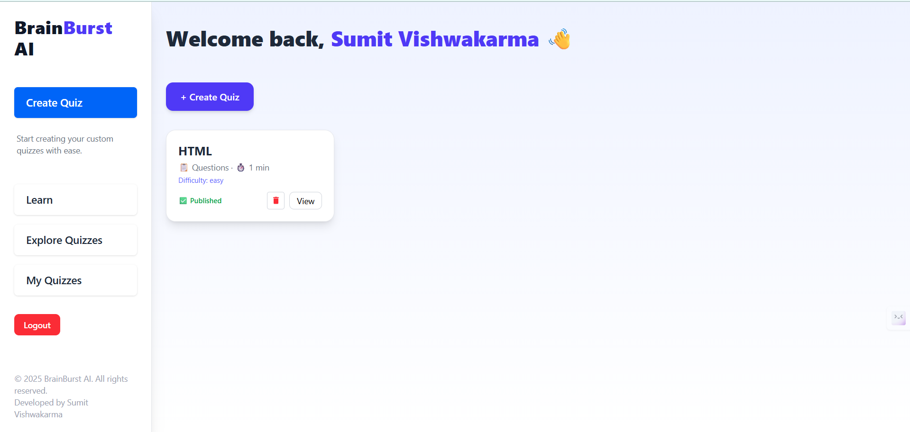
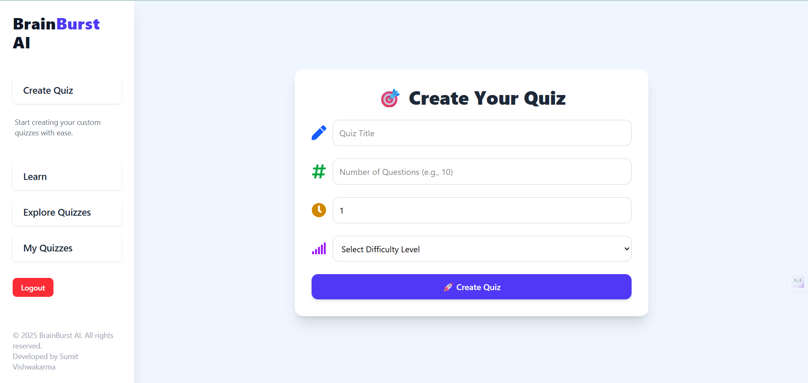
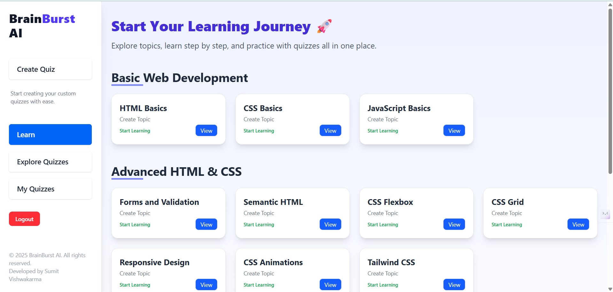
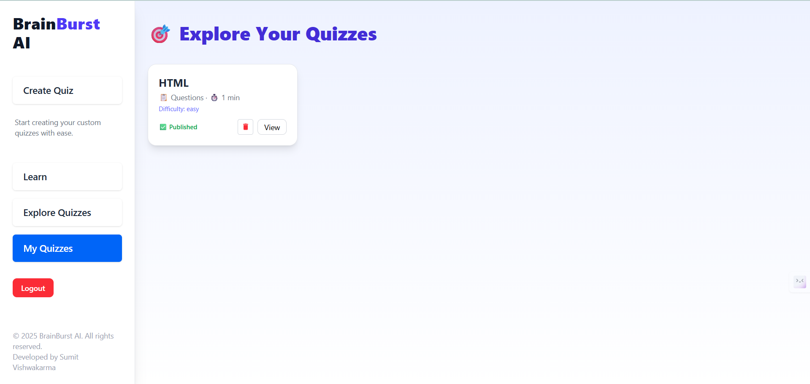

# BrainBurst AI 🧠⚡
An AI-powered quiz-generating web app that helps users **learn, practice, and test knowledge** all in one place.  
Powered by **Gemini API** for intelligent quiz creation and **JSONBin** for storing quizzes like a lightweight backend.

🌐 **Live Demo:** [https://your-live-link.com](https://your-live-link.com) *(replace with actual link)*

---

## 🚀 Features
- 🤖 **AI-Generated Quizzes** – Every time you generate, you get **fresh, unique quizzes** using **Gemini API**.
- 📚 **Learning Section** – Study concepts directly in the app without leaving the platform.
- 🔍 **Explore Quizzes** – Browse quizzes created by AI and saved in JSONBin.
- 📝 **Your Quizzes** – Save & access quizzes you generated earlier.
- 🎨 **Modern & Responsive UI** – Built with **React + TailwindCSS** for a clean, fast experience.
- 🔐 **Authentication (Frontend)** – Simple login/signup system using `localStorage`.
- 💾 **Persistent Storage** – User data and quizzes stored in **JSONBin** + localStorage.
- ⚡ **Lightweight Backend** – JSONBin acts as a backend, no need for complex server setup.

---

## 🛠️ Tech Stack
- **Frontend:** React.js, TailwindCSS
- **AI Integration:** Gemini API
- **Storage & Auth:** JSONBin (for quizzes), LocalStorage (for user state)

---

## 📂 Project Structure
```
BrainBurst-AI/
├── public/                 # Static assets (icons, images, etc.)
├── src/                    
│   ├── api/                # API integration (Gemini + JSONBin)
│   ├── components/         # Reusable UI components
│   │   └── learnPage/      # Components related to Learning page
│   ├── context/            # Context API for global state & auth
│   ├── hook/               # Custom React hooks
│   ├── pages/              # Page-level components (routes)
│   ├── utils/              # Utility functions (formatters, validators, constants)
│   ├── App.jsx             # Root component
│   ├── index.css           # TailwindCSS styles
│   └── main.jsx            # React entry point
├── .env                    # Environment variables (API keys)
├── package.json            # Dependencies & scripts
├── tailwind.config.js      # Tailwind configuration
└── README.md               # Project documentation
```

---

## 📖 App Sections Explained
### 📝 **Create Quiz**
- Users can generate a new quiz instantly using the **Gemini API**.
- The quiz is automatically saved to **JSONBin** for persistence.
- Each generated quiz is **unique and AI-driven**.

### 📚 **Learn**
- A section dedicated to learning concepts and practicing step by step.
- Acts as a **study mode** separate from quizzes.

### 🔍 **Explore Quizzes**
- Browse through AI-generated quizzes saved in **JSONBin**.
- Explore quizzes made by you or fetched from the database.

### 📂 **Your Quizzes**
- A personal collection of quizzes created by the user.
- Saved locally for quick access and also backed up in JSONBin.

### 🎨 **Clean & Responsive UI**
- Built with **TailwindCSS** for modern styling.
- Fully responsive across desktop, tablet, and mobile.

---

## 📸 Screenshots

- **Home Page**
- 
  
- **Create Quiz**
- 

- **Learn Section**
- 

- **Explore Quizzes**
- 

- **All Quizzes**
- 

---

## ⚙️ Installation & Setup

### 1. Clone the repository
```bash
git clone https://github.com/your-username/BrainBurst-AI.git
cd BrainBurst-AI
```

### 2. Install dependencies
```bash
npm install
```

### 3. Start development server
```bash
npm run dev
```

### 4. Build for production
```bash
npm run build
```

### 5. Preview production build
```bash
npm run preview
```

---

## 🔑 Environment Variables
Create a `.env` file in the root directory:

```env
VITE_GEMINI_API_KEY=your_gemini_api_key_here
VITE_JSONBIN_API_KEY=your_jsonbin_api_key_here
VITE_JSONBIN_BIN_ID=your_bin_id_here
VITE_JSONBIN_QUIZ_ID=your_quiz_bin_id_here
```

---

## 🌟 Future Improvements
- ⛅ Full backend (Node.js + MongoDB) for secure storage & authentication.
- 📊 Advanced quiz analytics (accuracy, progress charts, leaderboard).
- 🌐 Multi-language quiz support.
- 📱 Mobile app version (React Native / Flutter).

---

## 🤝 Contributing
Contributions, issues, and feature requests are welcome!  
Feel free to **fork this repo** and submit a pull request.

---

## 📜 License
Copyright (c) 2025 **Sumit Vishwakarma**
